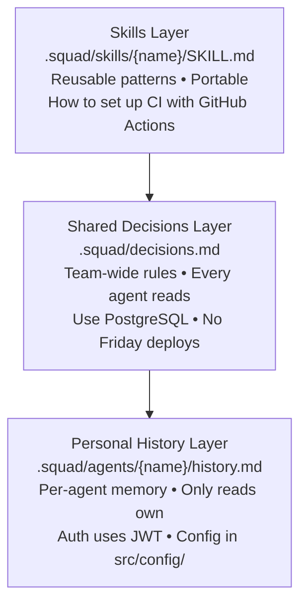
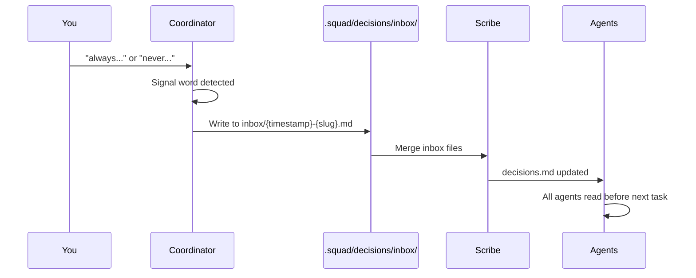

# Memory & Knowledge

> ⚠️ **Experimental** — Squad is alpha software. APIs, commands, and behavior may change between releases.


Squad remembers everything — coding conventions, architecture decisions, deployment patterns, your personal preferences. Memory grows with every session, compounding across three layers so agents stop making the same mistakes and start anticipating your needs.

---

## Try This

```
Always use single quotes in TypeScript
```

```
What decisions has the team made about testing strategy?
```

```
Show me what skills this team has learned
```

---

## How It Works

Memory lives in three layers, each serving a different purpose:



### How Memory Compounds

| Stage | What Agents Know |
|-------|-----------------|
| 🌱 First session | Project description, tech stack, your name |
| 🌿 After a few sessions | Conventions, component patterns, API design, test strategies |
| 🌳 Mature project | Full architecture, tech debt map, regression patterns, performance conventions |

The first session is always the least capable. Give the team a few sessions to build up context — they'll stop asking questions they've already answered.

---

## Personal Memory: `history.md`

Each agent has its own history file at `.squad/agents/{name}/history.md`. After every session, agents append what they learned — architecture decisions, conventions, file paths, user preferences.

**Only that agent reads its own history.** This means each team member builds specialized knowledge about their domain. Kane learns the auth system inside and out. Dallas masters the component library. Lambert memorizes the test infrastructure.

### Progressive Summarization

When an agent's `history.md` exceeds ~12KB, older entries get archived into a summary section. Recent entries stay detailed; older entries condense. This keeps files within a useful context budget without losing accumulated knowledge.

---

## Shared Decisions: `decisions.md`

Team-wide decisions live in `.squad/decisions.md`. **Every agent reads this before working.** This is the team's shared brain.

Decisions get captured three ways:

1. **From agent work** — agents write to `.squad/decisions/inbox/{agent-name}-{slug}.md`
2. **From your directives** — when you say "always…" or "never…" (see below)
3. **From Scribe merges** — the Scribe agent periodically consolidates inbox files into the canonical `decisions.md`, deduplicating overlapping entries

### Decision Archiving

As your project grows, `decisions.md` accumulates hundreds of blocks. Stale sprint artifacts and one-time planning fragments consume context without adding value. When this happens, old decisions archive to `.squad/decisions-archive.md` — preserved for reference but no longer loaded into agent context.

Active decisions (ongoing policies, user preferences, current architecture) stay in `decisions.md`. Agents always read the lean, current shared brain.

### Memory Architecture

```
.squad/
├── decisions.md                          # Shared — all agents read
├── decisions/inbox/                      # Drop-box for parallel writes
│   ├── kane-api-versioning.md
│   └── dallas-component-structure.md
├── decisions-archive.md                  # Archived old decisions
├── agents/
│   ├── kane/
│   │   └── history.md                    # Kane's personal memory
│   ├── dallas/
│   │   └── history.md                    # Dallas's personal memory
│   └── lambert/
│       └── history.md                    # Lambert's personal memory
└── skills/
    ├── squad-conventions/SKILL.md        # Starter skill
    └── ci-github-actions/SKILL.md        # Earned skill
```

---

## Directives

Directives are team rules that persist across sessions. Say "always" or "never" and Squad captures it permanently. Every agent reads directives before working.

### Signal Word Detection

The coordinator listens for these phrases and captures them as directives:

| Phrase | Example |
|--------|---------|
| `"always"` | "Always use TypeScript strict mode" |
| `"never"` | "Never commit directly to main" |
| `"from now on"` | "From now on, prefix all commits with the issue number" |
| `"remember to"` | "Remember to run tests before pushing" |
| `"don't"` | "Don't use var — only let and const" |
| `"make sure to"` | "Make sure to document all public APIs" |

### Capture Flow



### Directive Scope

Directives can shape:

- **Coding style** — formatting, naming conventions, language features
- **Tool preferences** — linters, formatters, test runners
- **Workflow rules** — branch naming, commit messages, PR templates
- **Scope constraints** — "Don't touch legacy/ directory"
- **Review requirements** — "Always have Lead review security changes"

### Directive Conflicts

When a new directive contradicts an existing one, the Scribe detects the overlap and asks you: "Replace, merge, or skip?" You decide, and `decisions.md` updates accordingly.

### Viewing and Removing Directives

```
Show me the team directives
```

```
What's our rule on testing?
```

```
Remove the no-Friday-deploy rule
```

You can also edit `.squad/decisions.md` directly — it's plain Markdown.

### Compliance

Directives are context-aware guidelines, not hard constraints. If an agent violates one, the [reviewer protocol](your-team.md#reviewer-protocol) catches it during review, or you flag it directly.

---

## Skills

Skills are reusable knowledge files that live at `.squad/skills/{skill-name}/SKILL.md`. Unlike decisions (project policies like "use PostgreSQL"), skills are transferable techniques ("how to set up CI with GitHub Actions").

**All agents can read any skill.** Skills are team-wide knowledge, not per-agent.

### Starter vs. Earned

| Type | Source | Example |
|------|--------|---------|
| **Starter** | Bundled at init, prefixed `squad-` | `squad-conventions` |
| **Earned** | Written by agents from real work | `ci-github-actions` |

Starter skills are overwritten on upgrade. Earned skills are never touched.

### Confidence Lifecycle

Earned skills have a confidence level reflecting how battle-tested they are:

| Level | Meaning |
|-------|---------|
| **Low** | First written — based on a single experience |
| **Medium** | Applied successfully in multiple contexts |
| **High** | Well-established, consistently reliable |

Confidence only goes up, never down. A skill that reaches `high` stays there.

### How Skills Get Used

1. **Before working** — agents read skill files relevant to the task
2. **During routing** — the coordinator checks skills when deciding who to spawn (an agent with a relevant earned skill may be preferred)
3. **After working** — agents may write new skills or update existing ones based on what they learned

### Portability

Skills export and import with your team. Move a trained team to a new repo, and all their earned knowledge comes along. This makes skills the most portable form of [team](your-team.md) intelligence.

---

## Tips

- **Commit `.squad/`** — anyone who clones the repo gets the team with all their accumulated knowledge.
- Directives ("always…", "never…") are the fastest way to shape team behavior. Use them liberally.
- If an agent keeps making the same mistake, check `decisions.md` — the relevant convention might be missing.
- You can edit `decisions.md`, `history.md`, and skill files directly. They're all plain Markdown.
- Manually seed skills by pasting your existing conventions into a `SKILL.md` — instant team knowledge.

---

## Sample Prompts

```
Always use Prettier with single quotes and no semicolons
```

Creates a coding style directive all agents will follow.

```
From now on, all commit messages must follow Conventional Commits format
```

Sets a workflow directive — agents format commits as `feat:`, `fix:`, `docs:`, etc.

```
What does Kane remember about the authentication system?
```

Queries Kane's personal `history.md` for relevant context.

```
Show me the team decisions about API design
```

Searches `decisions.md` for a particular topic.

```
Create a skill for our deployment process
```

Manually creates a new skill file and guides you through documenting the pattern.

```
Which skills have low confidence?
```

Finds recently-created skills that haven't been validated across multiple contexts yet.

```
Never use `any` type in TypeScript — always define explicit types
```

Establishes a type safety directive. Agents will avoid `any` and use proper types.

```
Search past decisions for database choices
```

Finds historical decisions related to a specific topic or keyword.
