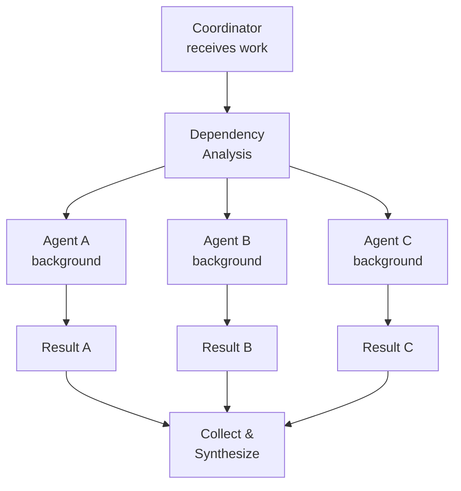
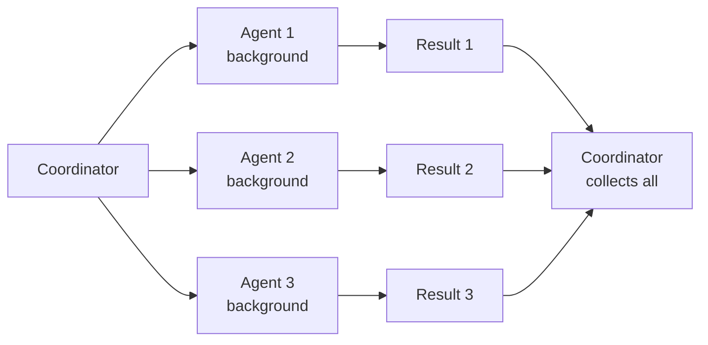
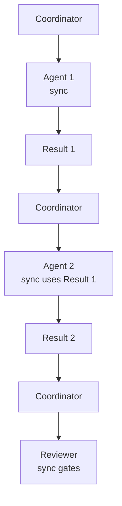

# Parallel Work & Models

> ⚠️ **Experimental** — Squad is alpha software. APIs, commands, and behavior may change between releases.


Squad launches independent work in parallel by default — multiple agents working simultaneously, no waiting. It also picks the right AI model for each agent based on what they're doing, so you get quality where it counts and speed everywhere else.

---

## Try This

```
Have three agents work on this in parallel: UI mockups, API spec, and database schema
```

```
Use Sonnet for code, Haiku for everything else
```

```
Work on issues #12, #15, and #18 at the same time
```

---

## How Parallel Execution Works

When the coordinator receives a multi-part task, it follows a fan-out pattern:



1. **Dependency Analysis** — Check if tasks have data dependencies (A needs output from B).
2. **Fan-Out** — Launch all independent agents in parallel using background mode.
3. **Wait** — Coordinator polls agent status until all complete.
4. **Collect** — Aggregate results, check for errors, route to next step.

### Example

> "Implement user authentication: API endpoints, frontend form, tests, and documentation"

Coordinator spawns **4 agents in parallel**:
- Backend → API endpoints
- Frontend → Login/signup form
- Tester → Integration tests
- DevRel → Auth documentation

All work simultaneously. No agent waits unless there's a code dependency.

---

## Background vs. Sync

| Mode | When Used | Behavior |
|------|-----------|----------|
| **Background** | Independent work, no data dependencies | Agents run in parallel, coordinator polls for completion |
| **Sync** | One agent needs another's output | Agents run sequentially, coordinator waits |
| **Sync** | Reviewer gate (Lead must approve first) | Agent runs, coordinator waits for [review](your-team.md#reviewer-protocol) decision |

### Background (Fan-Out)



Agents don't see each other's output until the coordinator collects and synthesizes.

### Sync (Dependencies & Gates)



Each step blocks until the previous completes.

### Eager Execution

Squad's default is **eager parallelism** — launch everything that can run, let the coordinator handle synchronization.

- **Faster throughput** — no artificial sequencing
- **Better utilization** — multiple agents saturate available compute
- **Resilient** — if one agent stalls, others keep working

Trade-off: increased API cost. If cost is a concern:

```
Work sequentially to save costs
```

### Deadlock Avoidance

When agents have circular dependencies (A needs B, B needs A), the coordinator detects the cycle and asks you to pick a resolution: run A first, run B first, or redesign.

### Concurrency Limits

- **Default:** 5 agents in parallel
- **Adjustable:** `"Run at most 2 agents at once"` → Coordinator batches work accordingly

---

## Model Selection

Squad routes each agent to the right AI model based on what they're doing — not a one-size-fits-all default.

### Selection Layers

First match wins:

| Layer | How It Works |
|-------|-------------|
| **1. User Override** | You said `"use opus"` or `"save costs"` — done, session-wide |
| **2. Charter Preference** | Agent's charter has a `## Model` section |
| **3. Task-Aware Auto** | Coordinator checks what the agent is actually doing (see table below) |
| **4. Default** | `claude-haiku-4.5` — cost wins when in doubt |

### Task-Aware Defaults

| Task Output | Model | Tier |
|-------------|-------|------|
| Writing code (implementation, refactoring, tests, bug fixes) | `claude-sonnet-4.5` | Standard |
| Writing prompts or agent designs | `claude-sonnet-4.5` | Standard |
| Non-code work (docs, planning, triage, changelogs) | `claude-haiku-4.5` | Fast |
| Visual/design work requiring image analysis | `claude-opus-4.5` | Premium |

### Role-to-Model Mapping

| Role | Default Model | Why |
|------|--------------|-----|
| Core Dev / Backend / Frontend | `claude-sonnet-4.5` | Writes code — quality first |
| Tester / QA | `claude-sonnet-4.5` | Writes test code |
| Lead / Architect | auto (per-task) | Mixed: code review vs. planning |
| Prompt Engineer | auto (per-task) | Prompt design is like code |
| DevRel / Writer | `claude-haiku-4.5` | Docs — not code |
| Scribe / Logger | `claude-haiku-4.5` | Mechanical file ops |
| Git / Release | `claude-haiku-4.5` | Changelogs, tags, version bumps |
| Designer / Visual | `claude-opus-4.5` | Vision capability required |

### Model Catalog (16 models)

Squad supports models across three tiers:

- **Premium:** claude-opus-4.6, claude-opus-4.6-fast, claude-opus-4.5
- **Standard:** claude-sonnet-4.5, gpt-5.2-codex, claude-sonnet-4, gpt-5.2, gpt-5.1-codex, gpt-5.1, gpt-5, gemini-3-pro-preview
- **Fast/Cheap:** claude-haiku-4.5, gpt-5.1-codex-mini, gpt-4.1, gpt-5-mini, gpt-5.1-codex-mini

### Fallback Chains

If a model is unavailable (plan restriction, rate limit, deprecation), Squad silently retries with the next in chain. Never falls back **up** in tier — a fast task won't land on a premium model.

```
Premium:  claude-opus-4.6 → claude-opus-4.6-fast → claude-opus-4.5 → claude-sonnet-4.5
Standard: claude-sonnet-4.5 → gpt-5.2-codex → claude-sonnet-4 → gpt-5.2
Fast:     claude-haiku-4.5 → gpt-5.1-codex-mini → gpt-4.1 → gpt-5-mini
```

---

## Copilot Coding Agent (@copilot)

Add the GitHub Copilot coding agent to your Squad as an autonomous team member. It picks up issues, creates branches, and opens PRs — all without a chat session.

### Prerequisites

1. **Copilot coding agent enabled** on the repo (Settings → Copilot → Coding agent)
2. **`copilot-setup-steps.yml`** exists in `.github/`
3. **GitHub Actions** enabled on the repo

### Quick Start

```bash
# Add @copilot with auto-assign
squad copilot --auto-assign

# Create a classic PAT (repo scope) and add as secret
gh secret set COPILOT_ASSIGN_TOKEN

# Commit and push
git add .github/ .squad/ && git commit -m "feat: add copilot to squad" && git push

# Test — label any issue with squad:copilot
```

Or in conversation: `"Add copilot to the squad with auto-assign enabled"`

### How @copilot Differs

| | AI Agent | Human Member | @copilot |
|---|----------|-------------|----------|
| Badge | ✅ Active | 👤 Human | 🤖 Coding Agent |
| Charter | ✅ | ❌ | ❌ (uses `copilot-instructions.md`) |
| Works in session | ✅ | ❌ | ❌ (async via issue assignment) |
| Creates PRs | Via session | Outside Squad | Autonomously |

### Capability Profile

The profile in `team.md` controls what @copilot handles:

| Tier | Meaning | Examples |
|------|---------|----------|
| 🟢 **Good fit** | Route automatically | Bug fixes, test coverage, lint fixes, dependency updates, small features, docs |
| 🟡 **Needs review** | Route but flag for review | Medium features with specs, refactoring with tests, API additions |
| 🔴 **Not suitable** | Route to a squad member | Architecture, multi-system design, security-critical, ambiguous requirements |

### Auto-Assign Flow

When the `squad:copilot` label is added to an issue:
1. Workflow posts a routing comment
2. Workflow assigns `copilot-swe-agent[bot]` to the issue
3. Coding agent creates a `copilot/*` branch and opens a draft PR

Auto-assign requires a classic PAT stored as `COPILOT_ASSIGN_TOKEN` (fine-grained PATs return 403 for this endpoint).

---

## Git Worktrees

Squad supports git worktrees with two strategies for teams working across multiple branches simultaneously.

### Worktree-Local (Independent State)

Each worktree gets its own `.squad/` directory. Agents in one worktree don't see state from another.

```
project/
├── .squad/                    # Main worktree team

project-feature-a/
├── .squad/                    # Feature A team (independent)

project-feature-b/
├── .squad/                    # Feature B team (independent)
```

**Best for:** multiple features with different teams, experimental branches, different compositions per worktree.

### Main-Checkout (Shared State)

All worktrees share `.squad/` from the main checkout via symlink.

```
project/
├── .squad/                    # Shared by all worktrees

project-feature-a/
├── .squad -> ../project/.squad/  # Symlink

project-feature-b/
├── .squad -> ../project/.squad/  # Symlink
```

**Best for:** same team on multiple branches, coordinated parallel development, solo dev with multiple branches.

### Which Strategy?

| Scenario | Strategy |
|----------|----------|
| Parallel features, same team | Main-checkout |
| Experimental branch, isolated team | Worktree-local |
| Hotfix + feature branch | Main-checkout |
| Multiple teams in same repo | Worktree-local |

Setup is one command: `"Use the main worktree's team"` (creates symlink) or `"Initialize Squad in this worktree"` (creates independent `.squad/`).

Squad uses `merge=union` for append-only log files to avoid conflicts across worktrees.

---

## Tips

- Eager parallelism is the default. Only switch to sequential if cost is a real concern.
- Start conservative with @copilot's capability profile and expand as you see what it handles well.
- Use `squad:copilot` labels with [issue-driven development](../scenarios/issue-driven-dev.md) for fully autonomous processing.
- Fallback chains are silent — you won't notice model switches unless you ask `"what model did Kane use?"`.
- For worktrees, main-checkout is usually the right choice unless you need truly isolated teams.

---

## Sample Prompts

```
Build the new dashboard feature — everyone work in parallel
```

Coordinator spawns all relevant agents (Frontend, Backend, Tester, DevRel) simultaneously.

```
Work on issues #12, #15, and #18 at the same time
```

Spawns 3 agents in parallel, one per issue.

```
Implement the API first, then write tests — do it sequentially
```

Forces sync mode: Backend completes, then Tester starts.

```
Run at most 2 agents at once to save costs
```

Sets concurrency limit. Coordinator batches work in groups.

```
Use opus for this architecture work
```

One-off override to premium model for a high-stakes task.

```
Always use haiku to save costs
```

Session-wide preference for the cheapest model tier.

```
Add copilot to the squad with auto-assign enabled
```

Adds @copilot to the roster and configures automatic issue assignment.

```
Use the main worktree's Squad team
```

Creates a symlink so this worktree shares the main checkout's `.squad/` state.
