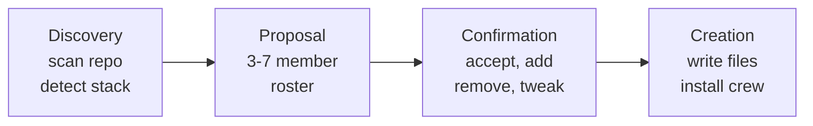

# Your Team

> ⚠️ **Experimental** — Squad is alpha software. APIs, commands, and behavior may change between releases.


Squad builds you a team of AI specialists that live in your repo. Tell it what you're working on, and it proposes a roster — backend devs, testers, writers, a lead — each with their own personality, expertise, and memory. Your team grows smarter every session.

---

## Try This

```
Set up a team for a React + Node.js API with PostgreSQL
```

```
Fenster, fix the login validation bug
```

```
Add a security specialist to the team
```

---

## How It Works

When you first run Squad in a repository, it walks through a four-step init flow:



1. **Discovery** — Squad scans your repo: languages, file structure, test frameworks, dependencies, existing workflows.
2. **Proposal** — It suggests a roster with 3–7 members tailored to what it found.
3. **Confirmation** — You review and customize: accept as-is, add roles, remove roles, rename members.
4. **Creation** — Squad writes the `.squad/` directory, creates charters, and sets up the coordinator.

### What Gets Created

```
.squad/
├── team.md                         # Team roster
├── routing.md                      # Work routing rules
├── decisions.md                    # Team memory (directives)
├── decisions/inbox/                # Pending decision writes
├── agents/
│   ├── {member}/
│   │   ├── charter.md              # Role, skills, voice
│   │   └── context.md              # Agent-specific notes
│   └── ...
├── skills/                         # Reusable knowledge files
├── log/                            # Execution logs
├── orchestration-log/              # Coordinator state
└── casting/                        # Universe assignments
```

### Default Team Composition

| Role | When Included |
|------|--------------|
| **Lead** | Always — triages, reviews, unblocks |
| **Core Dev** | Always — main implementation |
| **Tester** | If tests exist or test deps detected |
| **DevRel** | If README exists or `docs/` present |
| **Frontend** | If React/Vue/Svelte/Angular detected |
| **Backend** | If API routes, database code, or server framework detected |
| **Scribe** | Always — silent decision logger |

---

## Human Team Members

Not every team member needs to be AI. Add real people for decisions that need a human — design sign-off, security review, product approval.

```
Add Sarah as design reviewer
```

Sarah appears on the roster with a 👤 Human badge.

| | AI Agent | Human Member |
|---|----------|-------------|
| Badge | Role-specific emoji | 👤 Human |
| Charter | ✅ | ❌ |
| History | ✅ | ❌ |
| Spawned as sub-agent | ✅ | ❌ |
| Can review work | ✅ | ✅ |

When work routes to a human, Squad **pauses** and tells you someone needs to act. You relay the task outside of Squad, then report back what happened. Stale reminders keep things moving.

---

## Work Routing

The coordinator routes work automatically using three strategies. First match wins:

| Strategy | How It Works | Example |
|----------|-------------|---------|
| **Named** | You say who does it | `"Fenster, fix the login bug"` |
| **Domain** | Pattern matching in `.squad/routing.md` | `src/api/**` → Backend |
| **Skill-aware** | Capability check in `.squad/skills/` | Auth expertise → Backend or Lead |

**Routing priority:** Named > Domain > Skill-aware. If nothing matches, the Lead triages.

### Sample Routing Table

```markdown
| Pattern | Owner | Reason |
|---------|-------|--------|
| `src/api/**` | Backend | API implementation |
| `src/components/**/*.tsx` | Frontend | React components |
| `*.test.ts` | Tester | Test files |
| `docs/**` | DevRel | Documentation |
```

GitHub issues with `squad:{member}` labels route directly — `squad:fenster` goes to Fenster, no triage needed.

### Multi-Agent Work

Some tasks need multiple agents:

```
Fenster, implement the API. Hockney, write the tests.
```

The coordinator spawns both in parallel. They work independently and coordinate through shared `.squad/` state. See [Parallel Work & Models](parallel-work.md) for details.

---

## Reviewer Protocol

When a reviewer (Lead, Tester) rejects work, the original agent gets **locked out** — no self-revision allowed. This prevents endless fix-retry loops.

```
Agent A writes code → Lead rejects → Agent A locked out
  → Coordinator reassigns to Agent B or escalates to you
```

| Outcome | What Happens |
|---------|-------------|
| **Approve** | PR merges, issue closes, agent unlocked |
| **Request changes** | Author locked out, work reassigned or escalated |

### Lockout Details

- **Task-specific** — locked out of that PR/issue, not all work
- **Session-persistent** — survives restarts (stored in `.squad/orchestration-log/`)
- **Clearable** — `"Unlock Fenster for issue #42"`

### Reviewer Authority

| Reviewer | Scope |
|----------|-------|
| **Lead** | Code quality, architecture, security — all submissions |
| **Tester** | Correctness, test coverage — test-related changes |
| **You** | Final arbiter — can override any decision |

### Deadlock Handling

If all capable agents are locked out, the coordinator escalates to you with options: manual fix, unlock with guidance, or close as won't-fix.

---

## Ceremonies

Structured team meetings that trigger at key moments — automatically or on demand.

| Ceremony | Auto-Triggers When | What Happens |
|----------|-------------------|-------------|
| **Design Review** | Multi-agent task with 2+ agents modifying shared systems | Lead facilitates; agents weigh in on interfaces, risks, contracts |
| **Retrospective** | Build failures, test failures, reviewer rejections | Lead runs root-cause analysis; decisions written to `decisions.md` |

Run either manually anytime:

```
Run a design review before we start the authentication rebuild
```

You can also create custom ceremonies, disable auto-triggers, or skip a ceremony for a single task. Config lives in `.squad/ceremonies.md`.

---

## Response Modes

Squad auto-selects the right level of effort for each request:

| Mode | Time | What Happens | Triggered By |
|------|------|-------------|-------------|
| **Direct** | ~2–3s | Coordinator answers from memory, no agent spawned | Status checks, factual questions |
| **Lightweight** | ~8–12s | One agent, minimal prompt — skips charter/history/decisions | Small fixes, typos, quick follow-ups |
| **Standard** | ~25–35s | Full agent spawn with charter, history, and decisions | Normal work requests |
| **Full** | ~40–60s | Multi-agent parallel spawn, may trigger design review | Complex multi-domain tasks |

**Pro tip:** `"Team, ..."` prompts trigger Full mode. Named agent prompts (`"Kane, ..."`) trigger Standard. Quick questions get Direct automatically.

---

## Customizing After Init

| What You Say | What Happens |
|--------------|-------------|
| `"Add a database specialist"` | Coordinator casts a new member, creates charter, updates routing |
| `"Remove McManus from the team"` | Archives agent directory to `.squad/agents/.archived/`, updates team.md |
| `"Change the tester to focus on integration tests"` | Updates the tester's charter and expertise |
| `"Route all CSS files to Frontend"` | Adds a rule to `.squad/routing.md` |
| `"From now on, McManus reviews all docs before merge"` | Creates routing rule + [directive](memory-and-knowledge.md) |

Running `init` on an existing Squad repo automatically offers upgrade mode.

---

## Tips

- **Commit `.squad/`** to version control — anyone who clones the repo gets the full team with all accumulated knowledge.
- Use human members for approval gates: design review, compliance, final sign-off.
- Design reviews prevent agents from building conflicting implementations — let them run on multi-agent tasks.
- Retros produce [decisions](memory-and-knowledge.md) that improve future work, not just diagnose the current failure.
- You're the relay for human members. Squad can't message them directly — it tells you, and you coordinate.

---

## Sample Prompts

```
Start a new Squad team for this project
```

Triggers init mode — Squad analyzes the repo and proposes a team.

```
Fenster, implement the new search API. Hockney, write integration tests for it.
```

Named routing to two agents. Both spawn in [parallel](parallel-work.md).

```
Add Jordan as security reviewer
```

Adds a human team member with a specific review responsibility.

```
Route all database migrations to Backend
```

Adds a domain routing rule to `.squad/routing.md`.

```
Lead, review PR #15
```

Triggers review — Lead evaluates and either approves (merge) or rejects (lockout author).

```
Unlock Fenster for issue #42 — I've given better guidance
```

Clears lockout so Fenster can revise the PR with your additional context.

```
Run a retro on why those tests failed
```

Starts a retrospective ceremony to analyze failures and capture learnings.

```
Who handles authentication work?
```

Coordinator checks routing and skills, reports the responsible agent(s).
