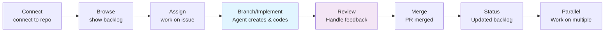

# Issue-Driven Development with Squad

> ⚠️ **Experimental** — Squad is alpha software. APIs, commands, and behavior may change between releases.


**Try this:**
```
Connect to myorg/recipe-app
```

End-to-end workflow: connect to a repo, pick issues from backlog, let agents create branches, implement, open PRs, handle review feedback, and close issues. See also [GitHub Issues Mode](../features/github-issues.md) for detailed guidance.

**Prerequisite:** The `gh` CLI must be installed and authenticated (`gh auth login`).

---

## 1. Connect to the Repository

Tell Squad which repo to track:

```
> Connect to myorg/recipe-app
```

```
✅ Issue source stored: myorg/recipe-app
   Using gh CLI for issue tracking.
```

Squad stores the issue source in team state. From now on, it can read issues, create branches, and open PRs against this repo.

---

## 2. View the Backlog

```
> Show the backlog
```

```
┌─────┬──────────────────────────────────────────┬───────────┬────────────┐
│  #  │ Title                                    │ Labels    │ Assignee   │
├─────┼──────────────────────────────────────────┼───────────┼────────────┤
│   7 │ Add dark mode support                    │ feature   │ —          │
│  12 │ Add ingredient search                    │ feature   │ —          │
│  15 │ Fix pagination on recipe list            │ bug       │ —          │
│  18 │ Add user profile page                    │ feature   │ —          │
│  21 │ Rate limiting on API endpoints           │ security  │ —          │
└─────┴──────────────────────────────────────────┴───────────┴────────────┘
5 open issues
```

---

## 3. Assign an Issue

Pick an issue for an agent to work on:

```
> Work on #15
```

Squad reads the issue, routes it to the right agent based on domain, and kicks off the full workflow:

```
🔧 Dallas — picking up #15 (Fix pagination on recipe list)

Dallas is reading the issue and starting work.
```

Behind the scenes, the agent:

1. **Creates a branch** — `15-fix-pagination-on-recipe-list`
2. **Implements the fix** — reads existing code, writes the change, adds tests
3. **Opens a PR** — linked to issue #15 with a description of the fix

When the agent finishes:

```
🔧 Dallas — Completed #15 (Fix pagination on recipe list)
   Branch: 15-fix-pagination-on-recipe-list
   PR: #22 opened — "Fix pagination on recipe list (#15)"
   Files changed:
   - src/routes/recipes.ts (fixed cursor calculation)
   - test/pagination.test.ts (3 new test cases)
```

---

## 4. Handle Review Feedback

A reviewer leaves comments on the PR. Tell Squad:

```
> There's review feedback on PR #22
```

Squad routes the feedback to the agent who opened it:

```
🔧 Dallas — reading review comments on PR #22

Dallas is addressing the feedback now.
```

The agent reads the comments, makes changes, and pushes new commits to the same branch:

```
🔧 Dallas — Addressed review feedback on PR #22
   - Added boundary check for empty result set (reviewer concern)
   - Added test case for zero-results pagination
   - Pushed 2 new commits to 15-fix-pagination-on-recipe-list
```

No force-pushes, no new branches. Just additional commits on the existing PR.

---

## 5. Merge

When the PR is approved:

```
> Merge PR #22
```

```
✅ PR #22 merged — "Fix pagination on recipe list (#15)"
   Issue #15 closed.
   Branch 15-fix-pagination-on-recipe-list deleted.
```

The issue closes automatically — the PR body includes a `Closes #15` reference.

---

## 6. Check Remaining Work

```
> What's left?
```

```
┌─────┬──────────────────────────────────────────┬───────────┬────────────┐
│  #  │ Title                                    │ Labels    │ Assignee   │
├─────┼──────────────────────────────────────────┼───────────┼────────────┤
│   7 │ Add dark mode support                    │ feature   │ —          │
│  12 │ Add ingredient search                    │ feature   │ —          │
│  18 │ Add user profile page                    │ feature   │ —          │
│  21 │ Rate limiting on API endpoints           │ security  │ —          │
└─────┴──────────────────────────────────────────┴───────────┴────────────┘
4 open issues
```

---

## 7. Work Multiple Issues in Parallel

Assign several issues at once:

```
> Work on #12 and #18
```

```
🔧 Dallas  — picking up #12 (Add ingredient search)
⚛️ Ripley  — picking up #18 (Add user profile page)
📋 Scribe  — logging session
```

Each agent creates its own branch and works independently. Both PRs open when agents finish.

---

## Full Lifecycle at a Glance



---

## Tips

- **You don't pick the agent.** Squad routes each issue to the agent whose expertise matches.
- **Agents name branches with the issue number.** Pattern: `{number}-{slugified-title}`.
- **PRs auto-link to issues.** The PR body includes `Closes #N`, so merging closes the issue.
- **Review feedback is incremental.** Agents push new commits — no force-pushes, no new PRs.
- **Decisions accumulate during issue work.** Agents record choices that carry forward across the backlog.
- **Work multiple issues in parallel.** Say `"Work on #12 and #18"` and each agent gets its own branch.
